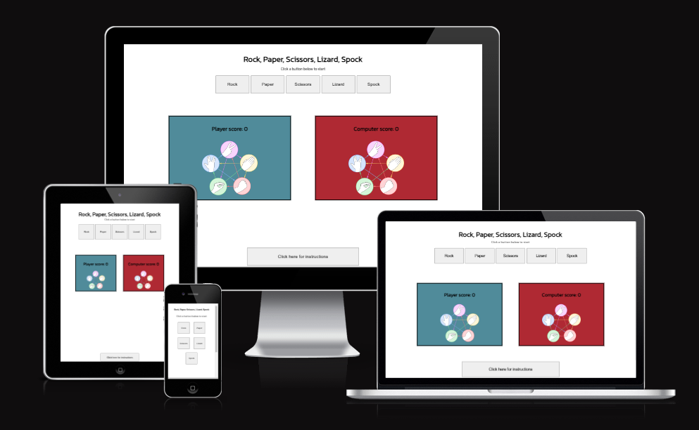
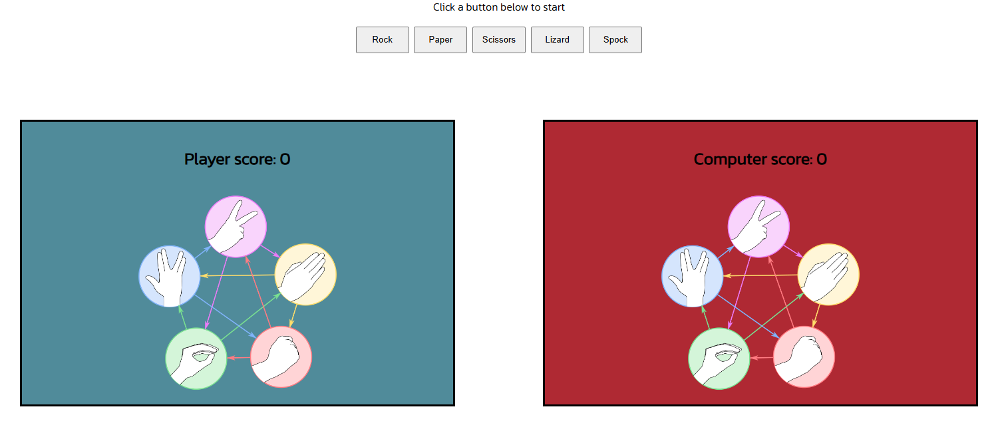
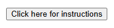
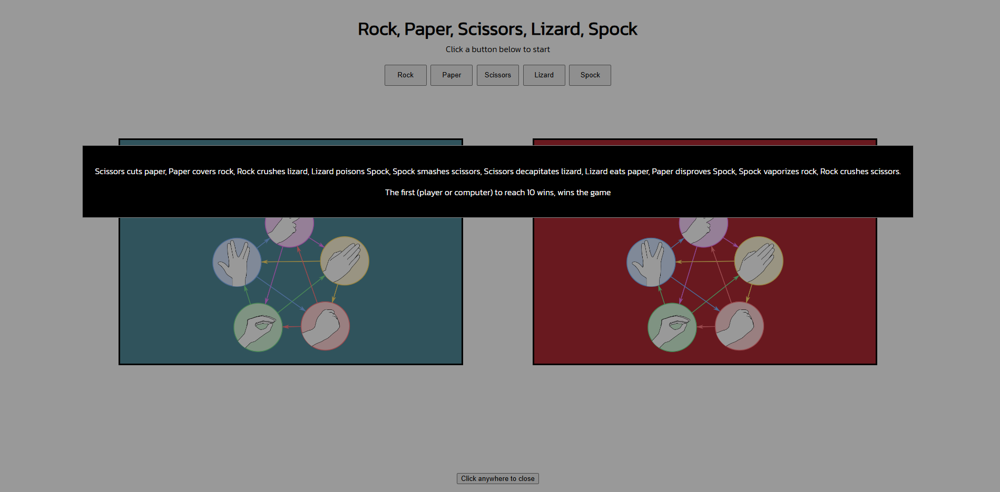
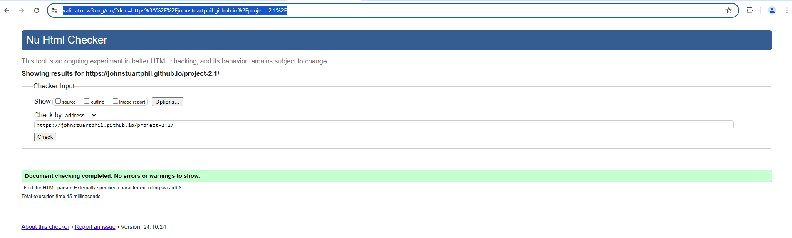

# Rock, Paper, Scissors, Lizard, Spock

Rock, Paper, Scissors, Lizard, Spock is a game invented by Sam Kass. It expands on the existing game of Rock, Paper Scissors. 
The rules of Rock, Paper Scissors are as follows: scissors cuts paper, paper covers rock, rock crushes scissors. 

The rules of Rock, Paper, Scissors, Lizard, Spock expand on the rules of Rock, Paper, Scissors and give a possible 10 outsomes: Scissors cuts Paper, Paper covers Rock, Rock crushes lizard, lizard poisons Spock, Spock smashes scissors, Scissors decapitates lizard, Lizard eats paper, Paper disproves Spock, Spock vaporizes rock, Rock crushes scissors. 

## Features 

- **Navigation**

  - Featured at the top of the page, the header shows the game name: Rock, Paper, Scissors, Lizard, Spock in a the kanit font and contrasts with the background. 
  - The header clearly tells the user what game they are playing. 

- **The Game Options**

  - The game options include a clear instruction and then a choice of options to choose from and to play: Rock, Paper, Scissors, Lizard or Spock. These options are interactive buttons that the user can click to make their choice and play their game. 

- **The Game Results**

  - When the user clicks an option, the image relating to their choice is shown on their side of the game board. 
  - The Javascript code chooses a random option for the computer player, displays the image relating to the computer's choice, and then determines who the winner is. 
  - The winner is announced to the user under the options button and the score is updated for either the user or the computer, depending on who won. 
  - The results and score are clear to the user, making the game easy to play, understand who won, and what the score is.

- **Instructions**

  - The instructions are in a pop-up modal which is featured in the footer of the website. 

## Testing 
  - I tested the webpage in different browsers: Chrome, Firefox, Microsoft Edge and WaveBrowser.
  - I confirmed that the game results are always correct.
  - I confirmed that the header, instructions in the modal (in the footer) are all readable and easy to understand. 
  - I confimred that the colors and fonts chosen are easy to read and accessiable by running it through Lighthouse in Dev tools

**Validator Testing**
- Javascript
  - No errors were retunred when passing through the official JS Hint.
- HTML 
  - No errors were retunred when passing through the official W3C validator.
- CSS 
  - No errors were retunred when passing through the official Jigsaw validator.
- Accessibility 
  - I confirmed that the colors and fonts chosen, are easy to read and accessible by running it through Lighthouse in both mobile and deskptop in Dev Tools.
  - WAVE was also used to test validity which has no errors nor contrast errors.

**Javascript testing, JS Hint**

**HTML testing, W3C validator**

![W3C valdiator screenshot]

**CSS testing, Jigsaw validator**

![Jigsaw validator screenshot]

## Deployment 
- The site was deployed to GitHub pages. The steps to deploy are as follows:

  - Go to the Settings tab of the GitHub repository.
  - In the code and automation section, select Pages.
  - In the build and Deployment section, under the Source section select Deploy from a Branch.
  - In the build and Deployment section, under the Branch section Main branch and Root file.
  - Within a few minutes the live site shall then be refreshed.

The live link can be found here - [Rock, Paper, Scissors, Lizard, Spock]

## Credits 

**Content**
- Initial code HMTL, CSS and JS code was taken from the scoping video for the Rock Paper Scissors project and amended accordingly. 
- Initial code for the Modal was taken from [W3Schools] (www.w3schools.com/howto/howto_css_modals.asp) and amended accordingly. 
- The icons used for the the Social Media links were taken from [Font Awesome](https://fontawesome.com/).
- The Fav Icon was constructed from [Fav Icon](https://favicon.io/).
- The Inter and Kannit fonts were taken from [Google Fonts](https://fonts.google.com/).
- The Rock, Paper, Scissors, Lizard, Spock images were taken from [The Big Bang Theory Fandom](https://bigbangtheory.fandom.com/wiki/Rock,_Paper,_Scissors,_Lizard,_Spock?)file=RPSLS.png

**Thanks to**

- Mentor: Matthew Bodden  
- Tutor: Thomas
 