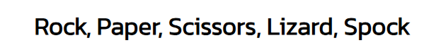
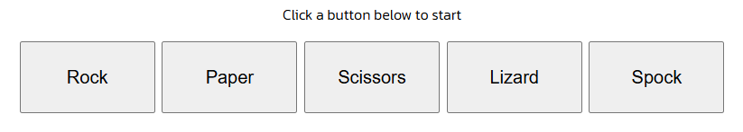
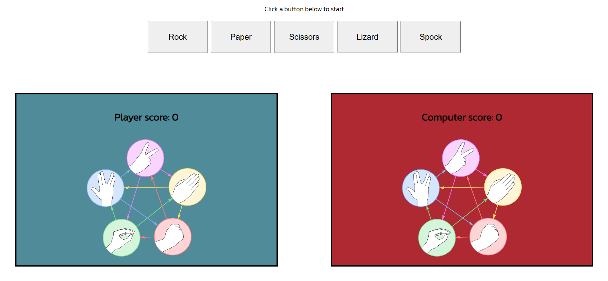
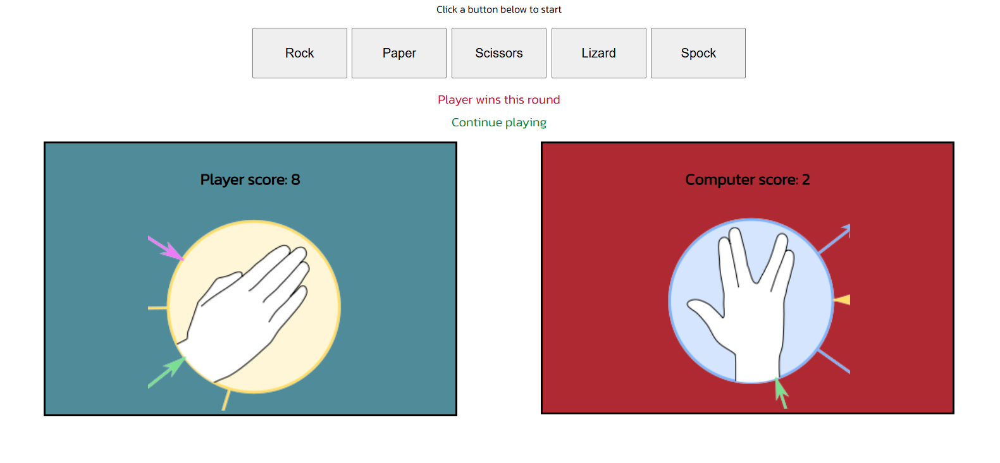
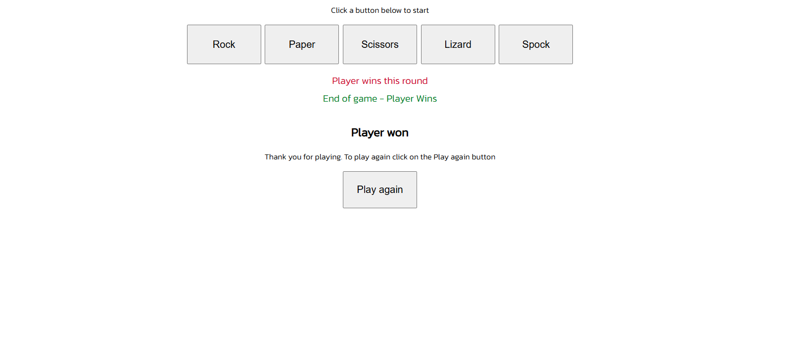
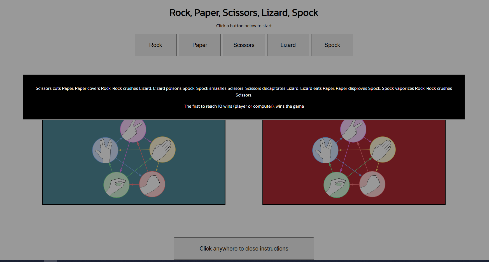
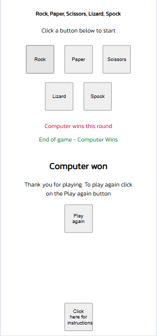
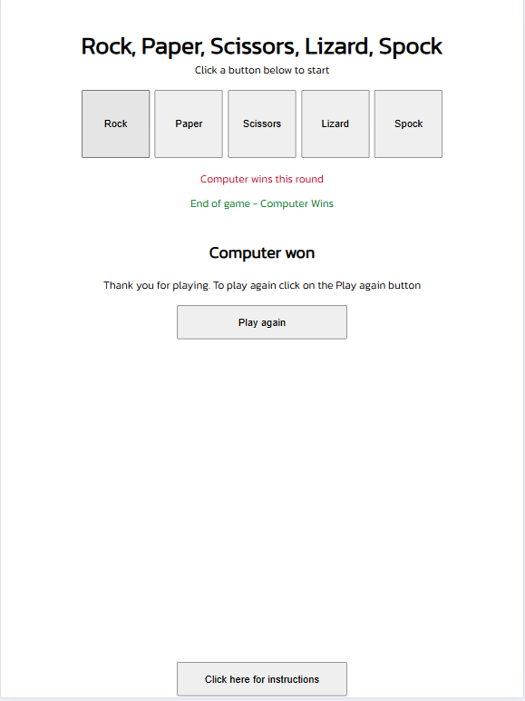
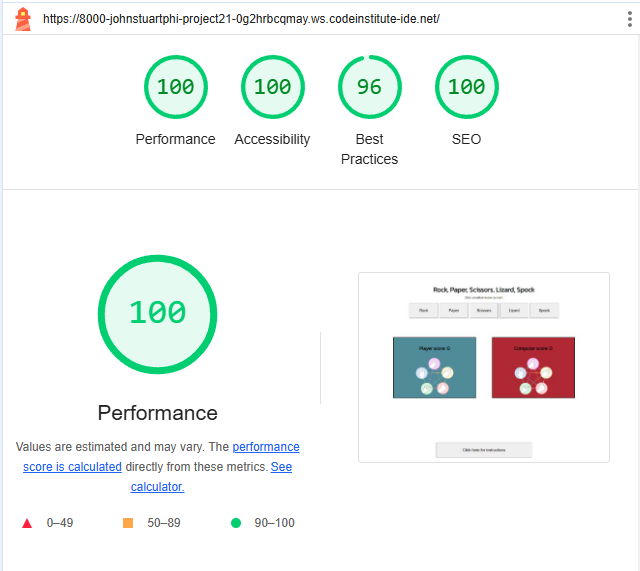
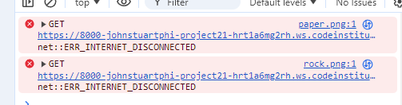

# Rock, Paper, Scissors, Lizard, Spock

Rock, Paper, Scissors, Lizard, Spock is a game invented by Sam Kass, which expands on the existing game of Rock, Paper Scissors. 
The rules of Rock, Paper Scissors are as follows: scissors cuts paper, paper covers rock, rock crushes scissors. 

The rules of Rock, Paper, Scissors, Lizard, Spock give a possible 10 outsomes: Scissors cuts Paper, Paper covers Rock, Rock crushes lizard, lizard poisons Spock, Spock smashes scissors, Scissors decapitates lizard, Lizard eats paper, Paper disproves Spock, Spock vaporizes rock, Rock crushes scissors. 

## Features 

- **Navigation**

  - Featured at the top of the page, the header shows the game name: Rock, Paper, Scissors, Lizard, Spock in a the kanit font and contrasts with the background. 
  - The header clearly tells the user what game they are playing. 

- **The Game Options**

  - The game options include a clear instruction and then a choice of options to choose from and to play: Rock, Paper, Scissors, Lizard or Spock. These options are interactive buttons that the user can click to make their choice and play their game. 

- **The Game Results**

  - When the user clicks on an option, the image relating to their choice is shown on the left side of the game area. 
  - The Javascript code chooses a random option for the computer player, displays the image relating to the computer's choice is shown on the left side of the game aresa. Both images appear instantly and determines who the winner is. 
  - The winner is displayed to the user under the Rock/Paper/Scissors/Lizard Spock option buttons and the score is updated for either the user or the computer, depending on who won. 
  - The results and score are clear to the user, making the game easy to play, understand who won, and what the score is.

  **At the start of the game:**

  **While the game is progressing:**

  **At the end of the game:**

  - When the play again button is pressed, it allows the user to select the Rock/Paper/Scissors/Lizard/Spock buttons again and play another game. 

- **Instructions**

  - The instructions are in a pop-up modal which is featured in the footer of the website. 

  - When the instructions button is pressed, they appear in the Modal.

- **For mobile screens**

  - The buttons on mobile screens were intentially made square-shaped to make it easier to touch using a finger.

   

**For tablet screens**

  - The rock/paper/scissors/lizard/spock buttons on tablet screens were intentially made square-shaped to make it easier to touch using a finger, while the buttons for instructions and to play again were made intentially rectangle.

   

## Testing 
  - I tested the webpage in different browsers: Chrome, Firefox, Microsoft Edge and WaveBrowser.
  - I confirmed that the game results are always correct.
  - I confirmed that the header, instructions in the modal (in the footer) are all readable and easy to understand. 
  - I confimred that the colors and fonts chosen are easy to read and accessiable by running it through Lighthouse in Dev tools

**Summary of testing**

| Test  | Section  | Action  | Result  | Pass/Fail  |
|---|---|---|---|---|
| 1  | Game Area  |Clicked on Rock button   | Brought up Rock image and Computer brought up a random image  | Pass  |
| 2  | Game Area  | Clicked on Paper button  |  Brought up Paper image and Computer brought up a random image | Pass  |
| 3  | Game Area  | Clicked on Scissors button   | Brought up Scissors image and Computer brought up a random image  |  Pass |
| 4  | Game Area   | Clicked on Lizard button  | Brought up Lizard image and Computer brought up a random image   | Pass  |
| 5 | Game Area  | Clicked on Spock button  | Brought up Spock image and Computer brought up a random image   | Pass  |
|  6 | Game Area   | Clicked on all of buttons  | The correct images appeared when a random choice was made by the computer (kept clicking until all 5 images had been seen) |  Pass |
|  7 | Game Area   | Clicked on any of the buttons until either player or computer won 10 times   | The correct message appeared (Player won this round/Computer won this round/This one's a Draw), the player and computer sections with the images disapeared and were replaced with the end message, Player Won or Computer Won   |  Pass |
| 8 |  End of Game Area  | Clicked on the play again button   | Brought the player and computer sections back up and allowed the playing of another game |  Pass |
|  9 | Footer   | Clicked on the Click here for instructions button   | Brought up the instructions in a modal and changed the text on the instructions button changed to 'click anywhere to close instructions' |  Pass |
|  10 | Body   | Clicked anywhere on the screen   | Made the instructions in the Modal dissapear and changed the text back on the button to 'click here for instructions'  |  Pass |

**Validator Testing**
- Javascript
  - No errors were retunred when passing through the official JS Hint (New Javascript features (ES6) assumed).
- HTML 
  - No errors were retunred when passing through the official W3C validator.
- CSS 
  - No errors were retunred when passing through the official Jigsaw validator.
- Accessibility 
  - I confirmed that the colors and fonts chosen, are easy to read and accessible by running it through Lighthouse in both mobile and deskptop in Dev Tools.
  - WAVE was also used to test validity which has no errors nor contrast errors.

**Javascript testing, JS Hint**

**HTML testing, W3C validator**

The link to the results can be found here - [RPSLS W3C HTML Validation results](https://validator.w3.org/nu/?doc=https%3A%2F%2Fjohnstuartphil.github.io%2Fproject-2.1%2F)

**CSS testing, Jigsaw validator**

The link to the results can be found here - [RPSLS Jigsaw CSS Validation results](https://jigsaw.w3.org/css-validator/validator?uri=https%3A%2F%2Fjohnstuartphil.github.io%2Fproject-2.1%2F&profile=css3svg&usermedium=all&warning=1&vextwarning=&lang=en)

**Lighthouse for Desktop results**

**Lighthouse for Mobile results**

**Wave results**

**Bugs**

   - While using DevTools to test on mobile screens, I noticed that the Rock/Paper/Scissors/Lizard/Spock images were not loading.
   - This was very much an intermiettent issue. Sometimes it was happing and sometimes it was not. 
   - I tried clicking on each button leaving a few seconds in between.
   - This was not an issue when testing on the desktop screens.

   - With assitance from tutoring, it turned out that this was possibly an issue with the internet connection at my end.

  - I tested the live link directly on my on mobile phone directly using the Vodafone network. The images all loaded correctly.

## Deployment 
- The site was deployed to GitHub pages. The steps to deploy are as follows:

  - Go to the Settings tab of the GitHub repository.
  - In the code and automation section, select Pages.
  - In the build and Deployment section, under the Source section select Deploy from a Branch.
  - In the build and Deployment section, under the Branch section Main branch and Root file.
  - Within a few minutes the live site shall then be refreshed.

The live link can be found here - [Rock, Paper, Scissors, Lizard, Spock](https://johnstuartphil.github.io/project-2.1/)

## Forking the Repository
- To Folk a repository, the steps are as follows:
  
  - Go to the Code tab of the GitHub repository.
  - Click on the down arrow of the Folk section.
  - This should create a copy of the repository in your own repository.
  - This copy could be used for testing purposes only without affecting the main repository.

## Cloning the Repository
- To make a clone of a repository, the steps are as follows:

  - Go to the Code tab of the GitHub repository.
  - Click on the down arrow of the green code button.
  - Select a URL provided and copy it to the clipboard.
  - Enter the URL into your browser.
  - Click on the green Gitpod Open button to open up Gitpod.
  - Type 'git clone'.
  - This shall bring up the slected repository at the time it was cloned ready to be edited.

## Credits 

**Content**
- Initial code HMTL, CSS and JS code was taken from the Code Institute scoping video for the Rock Paper Scissors project and amended accordingly. 
- Initial code for the Modal was taken from [W3Schools] (www.w3schools.com/howto/howto_css_modals.asp) and amended accordingly. 
- The icons used for the the Social Media links were taken from [Font Awesome](https://fontawesome.com/).
- The Fav Icon was constructed from [Fav Icon](https://favicon.io/).
- The Inter and Kannit fonts were taken from [Google Fonts](https://fonts.google.com/).
- The Rock, Paper, Scissors, Lizard, Spock images were taken from the website [The Big Bang Theory Fandom](https://bigbangtheory.fandom.com/wiki/Rock,_Paper,_Scissors,_Lizard,_Spock?)

**Thanks to**

- Mentor: Matthew Bodden  
- Tutor: Thomas
 